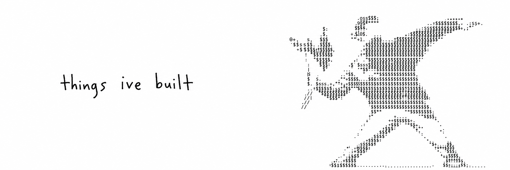

  

<h2 align="center">🔗 Connect with me</h2>

  
  
  
  

<h2>About me</h2>

Hello, I'm <b>Nabeel Ahmed</b> &mdash; a Frontend Developer focused on building clean, scalable, and modern web and mobile applications. I value structure, performance, and long-term maintainability over hype.

  <b>Frontend Developer</b> 
  <b>React / Next.js / TypeScript</b> 
  <b>Modern UI &amp; clean architecture</b> 
  <b>Strong GitHub collaboration mindset</b>

<h2>Technologies</h2>

<h3 align="center">Core Technologies</h3>

  
  
  
  
  
  
  

<h3 align="center">Frameworks &amp; Libraries</h3>

  
  
  
  
  
  

<h3 align="center">Team Collaboration</h3>

Experienced in team development using <b>GitHub</b>, pull requests, code reviews, and structured workflows.

<h2>Statistics</h2>

<h3 align="center">Dissoziated's GitHub Stats</h3>

  
  

<h2 align="center">🔥 Contribution Streak</h2>

  

<h2 align="center">📈 Contribution Graph</h2>

  

